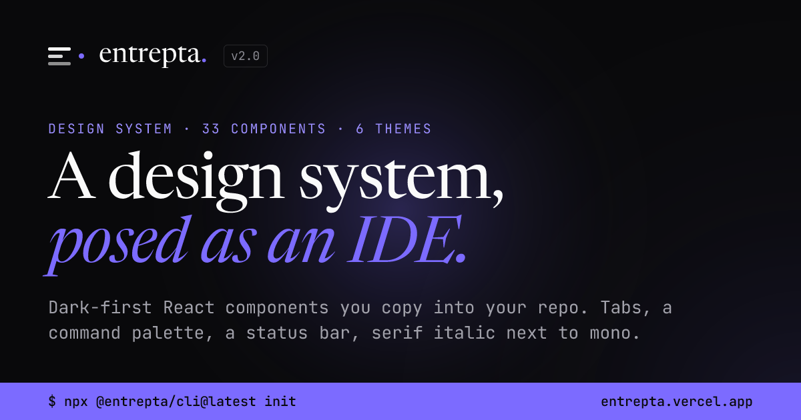

<p align="center">
  
</p>

<p align="center">
  <a href="https://entrepta.vercel.app">Docs</a> ·
  <a href="https://entrepta.vercel.app/docs/components">Components</a> ·
  <a href="https://entrepta.vercel.app/llms.txt">llms.txt</a> ·
  <a href="https://www.npmjs.com/package/@entrepta/cli">npm</a>
</p>

<p align="center">
  <a href="https://www.npmjs.com/package/@entrepta/cli"></a>
  
  
</p>

# entrepta

A dark-first design system for sites that look like an engineer built them. Tabs, a command palette, a status bar, shell prompts, serif italic next to mono.

Components are copied into your repo as source, in the shadcn model. No SDK, no runtime. You own the code.

```bash
npx @entrepta/cli@latest init
npx @entrepta/cli@latest add button card command-palette
```

## What you get

34 components across 6 sections, in React 19, Tailwind v4 and CSS variables.

| Section    | Components                                                         |
| ---------- | ------------------------------------------------------------------ |
| Primitives | Button, Badge, Avatar, Card, Dialog, Dropdown, Tooltip, Kbd, Tabs  |
| Forms      | Input, Textarea, Checkbox, Switch, Field, FilterPill               |
| Layout     | StatusBar, TopNav, ThemeSwitcher, ModeToggle, Sidebar, PageOutline |
| Content    | CodeBlock, SectHead, doc parts                                     |
| Feedback   | Toast, Skeleton, CommandPalette, ChromeMessage, PageLoading        |
| Motion     | Reveal, TypeIn, RollingNumber, Spotlight, ArrowLink                |

Six theme presets: `entrepta`, `blossom`, `marmalade`, `julia`, `ivy` and `bosco`. Pick one, or install all six and switch at runtime. Every text color clears WCAG AA in all 12 theme and mode combinations, and a test measures it on every change.

Upgrading from 1.x? The [migration guide](https://entrepta.vercel.app/docs/migrating-to-v2) lists every change and every new component, and copies as one Markdown file for your agent.

## Built for coding agents

entrepta is meant to be installed and used by Claude Code, Cursor or Codex as much as by people.

- **An AGENTS.md for your project.** The AGENTS.md button on the site builds one: pick the framework, theme and components, and it says how to install, where things live, which token goes where and how each component is used. It also writes CLAUDE.md.
- **Every docs page in Markdown.** Add `.md` to any docs URL, such as [`/docs/components/button.md`](https://entrepta.vercel.app/docs/components/button.md). Each page also has a copy for agent button.
- **[`/llms.txt`](https://entrepta.vercel.app/llms.txt)** indexes every page in the llmstxt.org format, and **[`/llms-full.txt`](https://entrepta.vercel.app/llms-full.txt)** is the whole site in one file.

## Install

### With the CLI

```bash
npx @entrepta/cli@latest init --theme=ivy

# all six themes, switchable at runtime
npx @entrepta/cli@latest init --theme=ivy --themes=all

npx @entrepta/cli@latest add button card field
```

`init` writes the tokens, the `cn` helper and `entrepta.json`. `add` copies each component with everything it imports and installs its npm packages. It works in Next.js (App or Pages Router) and Vite, and never overwrites a file without `--overwrite`.

### By hand

1. Install `clsx`, `tailwind-merge` and `class-variance-authority`
2. Copy `packages/registry/styles/globals.css` into your project, then append one file from `packages/registry/styles/themes/`
3. Copy `packages/registry/lib/utils.ts` for the `cn` helper
4. Copy any component from `packages/registry/` into `components/entrepta/`

Every component page has a **Manual** tab with its dependencies and the source, imports already rewritten.

## Use it

```tsx
import { Button } from "@/components/entrepta/button"
import { Card, CardHeader, CardLabel, CardTitle } from "@/components/entrepta/card"

export function Launch() {
  return (
    <Card variant="featured">
      <CardHeader>
        <CardLabel>launch</CardLabel>
      </CardHeader>
      <CardTitle>
        Ship it <em>tonight.</em>
      </CardTitle>
      <Button>deploy</Button>
    </Card>
  )
}
```

## Principles

1. **Dark-first.** Light mode exists; dark is the default.
2. **Editor as metaphor.** Tabs, a command palette, a status bar, file paths, comments.
3. **Deliberate type contrast.** Serif italic for names, mono for UI, sans for prose.
4. **Color used sparingly.** The brand only on actions, focus and featured states.
5. **High density, clear hierarchy.** A 12 column grid, 1280px wide.
6. **Motion with a job.** Every animation has a reduced-motion path, the JavaScript ones included.

## Built with entrepta

- [annamaria.app](https://annamaria.app), a personal site posed as an IDE, where entrepta started
- [wristkit](https://wristkit-web.vercel.app), Apple Health components for Next.js

## Stack

React 19, Next.js 15 as the reference setup, Tailwind v4, Radix UI, CSS variables, TypeScript strict, class-variance-authority, Phosphor icons, and `motion` for the four components that animate through JavaScript.

## Repo

```
entrepta/
├── apps/docs/            the site at entrepta.vercel.app
└── packages/
    ├── cli/              @entrepta/cli: init and add
    └── registry/         @entrepta/registry: components, tokens, themes, the manifest
```

```bash
pnpm install
pnpm dev --filter docs
pnpm lint && pnpm typecheck && pnpm test && pnpm build
```

## License

MIT. Built by [Anna Maria](https://annamaria.app).
